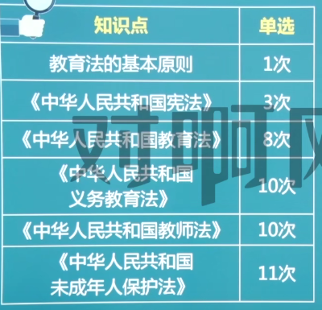
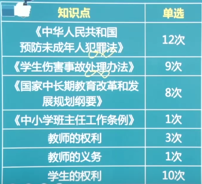

 

解题技巧：

1. 选择题：123不失分，45别耽误
2. 材料分析：给出材料，对里面人物的行为进行分析评价。分点回答
3. 阅读理解：文章的内容比较宽泛。先读题后看文章。
4. 写作：给一段材料，按照材料的立意进行写作，1000字，需要提前准备素材。

> 需要背诵熟记的，均已高亮展示

# 职业理念

  

## 素质教育（教育观）

全面贯彻党的教育方针，以提高**国民素质**为根本宗旨。

特点（理解）：全体性，全面性（全面提高），发展性（交给学生发展的方法），主体性（学生为主体），开放性（空间，方法），合作性（师生合作，同学合作），基础性（着重于基础素质），未来性（为学生未来着想）

> 发展性与未来性：前者是指交给学生自我提高的能力，后者是指不能只看当前的升学率。

### ==素质教育实施的基本要求== 

教育观评析：

1. 面向全体学生：全体、公正。
2. 促进学生全面发展：只重视某一方面是不对的
3. 促进学生创新精神和实践能力的培养：创新：保护好奇心、求知欲，尊重与众不同的想法。
4. 发展学生的主动精神，促进学生个性健康发展：主动：**灌输**错误，应该引导。个性：促进个性应该因材施教。
5. 着眼于学生的终身可持续发展：注重自我发展能力。

> 速记：主创终身体面

## 以人为本的学生观

学生观是指教育者对学生的基本看法，它支配着教育行为，决定着教育者的工作态度和工作方式。

### 内涵

“以人为本”，既是以学生为本，以学生的全面发展为本，以全体学生的全面发展为本，其核心是解决好培养什么人，怎么样培养人的重大问题。

### ==具体内容== 

1. 学生是具有独立意义的主体
   1. 学生在教育活动中处于主体地位
   2. 学生具有个体独立性，不以教师的意志为转移
   3. 学生在教育活动中具有主体的需求与责权
2. 学生是发展的人（分析题主要是后三点）
   1. 学生的身心发展具有规律性（顺序性、阶段性、不平衡性、互补性、差异性）
   2. 学生具有巨大的发展潜能（用发展的眼光看学生）
   3. 学生是处于发展过程中的人（理解学生不足，允许犯错）
   4. 学生的发展是全面的发展
3. 学生是具有个性和差异的人
   1. 承认学生差异和个性才能全面发展
   2. 要因材施教

> 速记：独立发展个性差异

### 运用（理解）

以学生全面发展为本、公平对待每一个学生、因材施教

## 教师观

### 职业认识（理解）

1. 劳动特征：复杂性，创造性，主体性，示范性，时空广阔，长期性，个体性，群体性，价值间接性
2. 角色特点：传道者，示范者，授业解惑者，家长代理人，研究者与学习者，教育教学活动的设计者、组织者和管理者

### 专业发展

#### 理论

福勒布朗：关注生存，关注情景，关注人。

#### 专业素养

学科专业素养（本体（专业）知识、实践性（教学方法）知识、条件性（心理、教育）知识、文化（通识）知识），教育专业素养，职业道德素养，职业心理素养。

#### 发展方法

终身学习、行动研究（研究课堂中出现的问题）、教学反思（对**以往**的教学反思）、同伴互助、专业引领（找专家进修）、课题研究

### ==教师观== 

1. 角色转变：

   1. 教师是学生学习的促进者
   2. 教师是课程的建设者和开发者
   3. 教师是教育教学的研究者
   4. 教师是社区型开放的教师

   > 颜射射发劲、醋

2. 行为转变：

   1. 在对待师生关系上，教师应尊重、赞赏学生
   2. 在对待教学关系上，教师应帮助、引导学生
   3. 在对待自我上，教师应注重反思
   4. 与其他教育者的关系上教师应加强合作

   > 思合赏银

# 教育法律法规

 

 

纲要和条例不怎么重要。

## 基本知识

### 基本原则

1. 公共性原则：要符合国家人民的利益
2. 方向性原则：要符合社会主义发展方向
3. 保障性原则：国家会优先保障教育发展
4. 公平性原则：受教育权力平等
5. 终身性原则

### 教育法律责任

1. 构成要件：违法行为与损害事实之间有因果关系，有损害事实，损害行为违法，行为人在主观上有过错。

2. 类型：民事（最轻，可以协商）、行政、刑事。

   > 行政处罚：是特定的**国家行政机关**对违反行政管理法律法规的公民、法人或者其他组织依法给予的制裁。**对外**。
   >
   > 行政处分：是国家机关、企业事业单位和社会团体依据行政管理法规、规章、纪律等对其**所属人员违规**、违纪行为所作的处罚。**对内**。

3. 教育法律救济：教育法律关系主体的合法权益受到侵犯并造成损害时，获得**恢复和补救**的法律制度。

## 主要的教育法律法规

### 宪法

**根本大法，规定拥有最高的法律效力**。

1. 总纲：第一条中华人民共和国是**工人阶级**领导的、以**工农联盟**为基础的**人民民主专政**的社会主义国家。
   **社会主义制度**是中华人民共和国的**根本**制度。**中国共产党领导**是中国特色社会主义**最本质的特征**。禁止任何组织或者个人破坏社会主义制度。
   第二条中华人民共和国的**一切权力属于人民**。
   人民行使国家权力的机关是**全国人民代表大会和地方各级人民代表大会**。
   第三条中华人民共和国的国家机构实行**民主集中制**的原则。
   全国人民代表大会和地方各级人民代表大会都由**民主选举**产生，对人民负责，受人民监督。
   国家行政机关、监察机关、审判机关、检察机关都由**人民代表大会**产生，对它负责，受它监督。

2. 公民的基本权利和义务：第三十三条凡具有中华人民共和国**国籍**的人都是中华人民共和国公民。
   中华人民共和国公民在法律面前**一律平等**。
   国家**尊重和保障人权**。
   任何公民享有宪法和法律规定的权利，同时必须履行宪法和法律规定的义务(权责一致)。

3. 国家机构：第五十七条中华人民共和国全国人民代表大会是**最高国家权力机关**,它的常设机关是全国人民代表大会**常务委员会**。
   第五十八条全国人民代表大会和全国人民代表大会常务委员会行使国家**立法权**。
   第六十条全国人民代表大会每届**任期五年**。
   第八十五条中华人民共和国**国务院**（中央人民政府），是最高国家权力机关的**执行机关**，是**最高国家行政机关**。
   第一百二十三条中华人民共和国各级监察委员会是国家的监察机关。
   第一百二十四条中华人民共和国设立国家监察委员会和地方各级监察委员会。

   第一百二十五条中华人民共和国**国家监察委员会是最高监察机关**。
   国家监察委员会**领导**地方各级监察委员会的工作，上级监察委员会领导下级监察委员会的工作。
   第一百三十二条**最高人民法院是最高审判机关**。
   最高人民法院**监督**地方各级人民法院和专门人民法院的审判工作，上级人民法院监督下级人民法院的审判工作。

   第一百三十四条中华人民共和国人民检察院是国家的**法律监督机关**。
   第一百三十七条**最高人民检察院是最高检察机关**（也是法律监督机关）。
   最高人民检察院**领导**地方各级人民检察院和专门人民检察院的工作，上级人民检察院领导下级人民检察院的工作。

   > 只有法院的上下级是监督关系
   >
   > 同级的人民政府领导同级的公安机关

   |          机构          |                     性质                     |
   | :--------------------: | :------------------------------------------: |
   |          人大          |              权力机关（立法权）              |
   |        全国人大        |               最高国家权力机关               |
   |     全国人大常委会     |                   常设机关                   |
   | 国务院（中央人民政府） | （最高）行政机关 （权力机关的执行机关） |
   |    （最高）人民法院    |               （最高）审判机关               |
   |   （国家）监察委员会   |               （最高）监察机关               |
   |   （最高）人民检察院   |             （最高）法律监督机关             |
   |        公安机关        |              行政机关、司法机关              |

   

4. 第一百四十一条中华人民共和国国旗是五星红旗。
   中华人民共和国国歌是《义勇军进行曲》。第一百四十二条中华人民共和国国徽，中间是**五星照耀下的天安门**，周围是**谷穗和齿轮**。
   第一百四十三条中华人民共和国首都是北京。

### 教育法

1. 第八条【教育符合国家利益】
   教育活动必须符合国家和社会**公共利益**。国家实行**教育与宗教相分离**。任何组织和个人不得利用宗教进行妨碍国家教育制度的活动。第九条【教育权利和义务】
   中华人民共和国公民有受教育的**权利和义务**。公民不分民族、种族、性别、职业、财产状况、宗教信仰等，依法享有**平等**的受教育机会。
   第十二条【语言文字】
   国家通用语言文字为学校及其他教育机构的基本教育教学语言文字(普通话），学校及其他教育机构应当使用国家通用语言文字进行教育教学。

   第十四条【管理制度】
   国务院和地方各级人民政府根据**分级管理、分工负责**的原则，领导和管理教育工作。**中等**及中等以下教育在国务院领导下，由**地方人民政府管理**。**高等教育**由**国务院和省、自治区、直辖市人民政府**管理。

   第二十一条【教育考试制度】国家实行国家教育考试制度。
   第二十二条【学业证书制度】国家实行学业证书制度。
   第二十三条【学位制度】国家实行学位制度。
   第二十五条【教育督导制度和教育评估制度】国家实行教育督导制度和学校及其他教育机构教育评估制度。

2. 第二十七条【办学条件】（钱、地、人、法）
   设立学校及其他教育机构，必须具备下列基本条件:
   1.有**组织机构和章程**;2有**合格的**教师;3．有**符合规定标准**的教学**场所**及设施、设备等;4.有必备的办学**资金**和稳定的经费来源。

   第三十一条【教育机构的管理机制】学校及其他教育机构的校长或者主要行政负责人必须由具有中华人民共和国**国籍**、在中国境内**定居**、并具备国家规定**任职条件**的公民担任，其任免按照国家有关规定办理。学校的教学及其他行政管理，由**校长负责**。学校及其他教育机构应当按照国家有关规定，通过以教师为主体的**教职工代表大会**等组织形式，保障教职工参与民主管理和监督。

   第三十二条【教育机构的法人条件】学校及其他教育机构具备法人条件的，自**批准设立或者登记注册**之日起取得法人资格。
   学校及其他教育机构在民事活动中依法享有民事权利，承担民事责任。
   学校及其他教育机构中的**国有资产**属于国家所有。
   学校及其他教育机构兴办的**校办产业独立**承担民事责任。

3. 第四十三条【受教育者的权利】受教育者享有下列权利:
   1.参加教育教学计划安排的各种活动，使用教育教学设施、设备、图书资料;
   2.按照国家有关规定获得奖学金、贷学金、助学金;
   3.在学业成绩和品行上**获得公正评价**，完成规定的学业后获得相应的**学业证书、学位证书**;
   4.对学校给予的处分不服向有关部门提出申诉，对学校、教师侵犯其人身权、财产权等合法权益，提出申诉或者依法提起诉讼;
   5.法律、法规规定的其他权利。

## 教师的权利和义务

## 学生的权利和保护