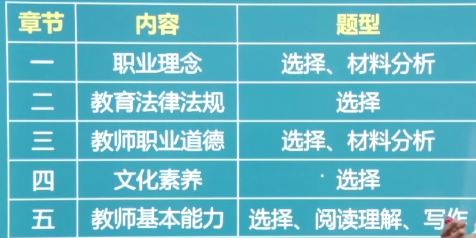

 

解题技巧：

1. 选择题：123不失分，45别耽误
2. 材料分析：给出材料，对里面人物的行为进行分析评价。分点回答
3. 阅读理解：文章的内容比较宽泛。先读题后看文章。
4. 写作：给一段材料，按照材料的立意进行写作，1000字，需要提前准备素材。

> 需要背诵熟记的，均已高亮展示

# 职业理念

  

## 素质教育（教育观）

全面贯彻党的教育方针，以提高**国民素质**为根本宗旨。

特点（理解）：全体性，全面性（全面提高），发展性（交给学生发展的方法），主体性（学生为主体），开放性（空间，方法），合作性（师生合作，同学合作），基础性（着重于基础素质），未来性（为学生未来着想）

> 发展性与未来性：前者是指交给学生自我提高的能力，后者是指不能只看当前的升学率。

### ==素质教育实施的基本要求== 

教育观评析：

1. 面向全体学生：全体、公正。
2. 促进学生全面发展：只重视某一方面是不对的
3. 促进学生创新精神和实践能力的培养：创新：保护好奇心、求知欲，尊重与众不同的想法。
4. 发展学生的主动精神，促进学生个性健康发展：主动：**灌输**错误，应该引导。个性：促进个性应该因材施教。
5. 着眼于学生的终身可持续发展：注重自我发展能力。

> 速记：主创终身体面

## 以人为本的学生观

学生观是指教育者对学生的基本看法，它支配着教育行为，决定着教育者的工作态度和工作方式。

### 内涵

“以人为本”，既是以学生为本，以学生的全面发展为本，以全体学生的全面发展为本，其核心是解决好培养什么人，怎么样培养人的重大问题。

### ==具体内容== 

1. 学生是具有独立意义的主体
   1. 学生在教育活动中处于主体地位
   2. 学生具有个体独立性，不以教师的意志为转移
   3. 学生在教育活动中具有主体的需求与责权
2. 学生是发展的人（分析题主要是后三点）
   1. 学生的身心发展具有规律性（顺序性、阶段性、不平衡性、互补性、差异性）
   2. 学生具有巨大的发展潜能（用发展的眼光看学生）
   3. 学生是处于发展过程中的人（理解学生不足，允许犯错）
   4. 学生的发展是全面的发展
3. 学生是具有个性和差异的人
   1. 承认学生差异和个性才能全面发展
   2. 要因材施教

> 速记：独立发展个性差异

### 运用（理解）

以学生全面发展为本、公平对待每一个学生、因材施教

## 教师观

### 职业认识（理解）

1. 劳动特征：复杂性，创造性，主体性，示范性，时空广阔，长期性，个体性，群体性，价值间接性
2. 角色特点：传道者，示范者，授业解惑者，家长代理人，研究者与学习者，教育教学活动的设计者、组织者和管理者

### 专业发展

#### 理论

福勒布朗：关注生存，关注情景，关注人。

#### 专业素养

学科专业素养（本体（专业）知识、实践性（教学方法）知识、条件性（心理、教育）知识、文化（通识）知识），教育专业素养，职业道德素养，职业心理素养。

#### 发展方法

终身学习、行动研究（研究课堂中出现的问题）、教学反思（对**以往**的教学反思）、同伴互助、专业引领（找专家进修）、课题研究